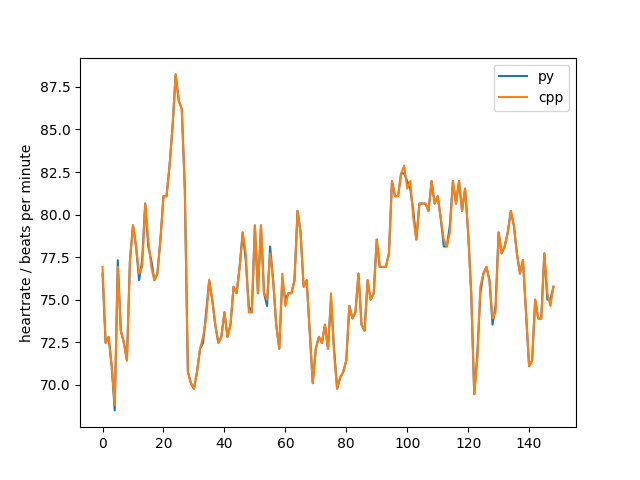

# engzee_ecg_detector

C++ implementation of: W. Engelse and C. Zeelenberg, “A single scan algorithm for QRS detection and feature extraction”, IEEE Comp. in Cardiology, vol. 6, pp. 37-42, 1979 with modifications A. Lourenco, H. Silva, P. Leite, R. Lourenco and A. Fred, “Real Time Electrocardiogram Segmentation for Finger Based ECG Biometrics”, BIOSIGNALS 2012, pp. 49-54, 2012.

Based on the Python version of the EngZee detector (https://github.com/berndporr/py-ecg-detectors) initially written by Luis Howell.

## Usage

The detector is header-only:
```
include "engzee.h"
```

Create a heartrate callback:

```
struct MyCallback : HRCallback {
        virtual void hasHR(float hr) {
		// do something with the heartrate
        }
};

```

Create an instance of the callback and the detector:
```
MyCallback callback;
Engzee engzee(fs,callback);
```

Call the detector sample by sample for example from an ADC
callback:
```
engzee.detect(ecg);
```
where the `ecg`-samples should be in mV and the mains (50 or 60Hz) needs
to be removed, for example with a butterworth filter.

## Demo

Install the IIR filter library (https://github.com/berndporr/iir1)
which is used to remove the mains interference.

Run:
```
cmake .
make
./demo
```
and it will print the heartrate from an example ECG and
save it to `hr.dat` which can be plotted for example
gnuplot or the script `plot_hr.py`.

If you have the python detector installed then you can
compare its output with that from this detector:
`compare_cpp_and_python_detector.py`



# Credit

Bernd Porr
